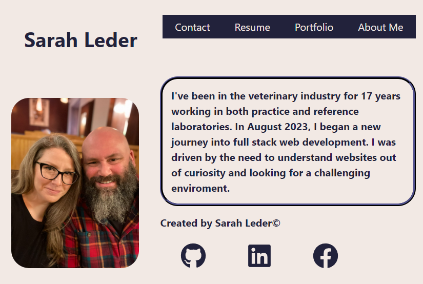

# SarahL-Portfolio
by Sarah Leder

## Table of Contents
* [Description](#description)
* [Credits](#additional-credits)
* [Usage](#usage-information)
* [Questions](#contact)

### Description
This website serves as a showcase of utilizing a new skill with React and working on a professional portfolio to present to employeers. Click through this one page application to see a Contact Form, Portfolio, Resume, and About Me.
 
### Additional Credits
BCA Learning Assistant, W3 Schools, Coolors website, Stack Overflow, and the following videos on YouTube:
https://www.youtube.com/watch?v=Rh3tobg7hEo
https://www.youtube.com/watch?v=SLfhMt5OUPI

### Usage Information
Simply follow the link to the webpage: https://main--fluffy-cheesecake-a26cdf.netlify.app/Portfolio

### Contact
For questions, please contact me on my website: https://main--fluffy-cheesecake-a26cdf.netlify.app/Portfolio
Github: (https://github.com/Trinity16201/)

Screenshot:

